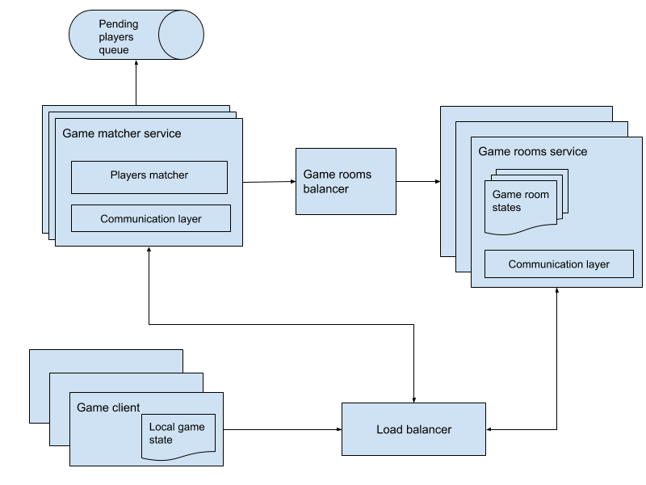

# Online Multiplayer Snake
This is a 2 players online web version of the classic Snake game developed as part of a 2-week onboarding process with the objective of familiarizing with technologies in use at the company like Golang and the gRPC communication protocol.

## System Design
Half of the assignment was to develop a system design that assumed this system would have to scale up to tens of thousands of simultaneous players. 
The main architecture is depicted below:



The whole document can be found here: [Distributed 2-Players Snake Design](https://docs.google.com/document/d/1FfXP6QN2Liey96KQuUbFl7fTTmicdZVIdOH-jswGKSw/edit?pli=1#heading=h.j2korreddfmj)

## Implementation
The code is separated in 3 folders:

- `snakeserver`: Golang code for the game server
- `proto`: Protocol buffers definitions for services communication
- `client`: Pure Javascript (old-school, no-frameworks) implementation of a Game client.

### Design considerations
When analysing the implementation it might be convenient to bare in mind the following design decisions:

- The protocol design was made considering that adding more players should require no changes. Also, most of the code, except for the game room initialization doesn't assume the players are only 2.

- Board size is an attribute of the Game Room. This way, it would be easy to support the requirement that board size adapted to players' resolution or any other factor. Also, default board size is a server initialization parameter.

- The players matcher's implementation only works with a single game server instance. Otherwise, the current pending's channel would have to be replaced by a central queue.

## Running the Game
After cloning the repo just issue a:
```
$ docker-compose up
```

This will start 3 containers:

- Snake Server on port 9090
- Envoy Proxy on port 8080 (Required by the web version of gRPC, see below)
- Web server on port 8081

Once the containers are up and running you can enter the 
game by opening `http://localhost:8081` on any web browser.

## Development 
Before being able to running the services in development mode you
need to install the required dependencies.

### Dependencies
The following dependencies need to be installed:

- Golang
- Setup `GOPATH` and add `~/go` to `PATH` in `.bash_profile` or `.zprofile` depending on your OS shell.
- Protocol Buffers (https://github.com/protocolbuffers/protobuf/releases)
- Protocol Buffers Web Support (https://github.com/grpc/grpc-web/releases). Follow installation instructions from https://github.com/grpc/grpc-web
- Docker

### Development cycle
To facilitate development a `Makefile` is included with several 
useful comands:

- `install-deps`: Will install clients dependencies. Needed before 
running the client.
- `start-client`: Will compile and start the client using a simple
http python web server
- `start-server`: Will run the snake server locally (without docker)
- `start-proxy`: Will start the Envoy container that you can leave 
running in the background during development (it's required for using
web gRPC)
- `protos`: Builds the protocol buffers interfaces for Goland and Javascript. You should run this command every time you change the 
protocols definitions.

## TODO
This implementation was done from scratch in a week while at the same time learning Golang, gRPC and online game development. As such, many things that were part of the design were left out of scope to satisfy the deadline imposed by the task. Some of those things are:

- Tests
- Server validation of moves and cheating detection
- Services separation
- Fine tuning on game over conditions like penalizing a player that crashes it's snake onto itself, or detecting which player hits another one, etc.
- Game pause/abort on the UI
- A better UI

Also, I'm sure the code could be structured in a much-cleaner way with more time and Golang experience.
Nonetheless, it's quite playable! :)